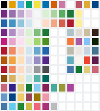

## About

This palette contains a selection of 20 qualitative and diverging color schemes from various sources. It is specifically written for the LibreOffice Suite (Calc, Writer, Impress etc.).

Inspiration for this project came after reading Okabe's & Ito's article on [Color Universal Design (CUD)](https://jfly.uni-koeln.de/color/). I strongly recommend reading this article, as it contains valuable information about color blindness in general as well as a range of advice and examples on how to make your charts, maps etc. more accessible for color blind people.

This palette is a work in progress. I will add a few sequential schemes in the future. I may also rearrange the layout, drop or incorporate some schemes. Feedback is highly encouraged and valued!

**Cheers!**

## Note

LibreCalc save correct color values only to _ods_ formats, whereas Writer saves the values correctly to _odt_, _doc_ and _docx_.

## File Locations:

Simply save to file to:

/usr/lib/libreoffice/share/palette/ on **Linux**

C:\Program Files\LibreOffice\share\palette\ on **Windows**

/installation-folder/share/palette on **MacOS**

## References

This project incorporates work from:

- Masatak Okabe & Kei Ito: [Color Universal Design (CUD)](https://jfly.uni-koeln.de/color/)
- Paul Tol: [Color Schemes](https://personal.sron.nl/~pault/data/colourschemes.pdf)
	- partly with adaptations from Cynthia A. Brewer: [ColorBrewer](http://colorbrewer2.org)
- US Department of Commerce, National Institute of Standards and Technology: [RGB Color Palettes](https://www.itl.nist.gov/div898/software/dataplot/dpmacros/rgb_color_palettes.pdf)
- Rachel Cravit: [How to Use Color Blind Friendly Palettes to Make Your Charts Accessible](https://venngage.com/blog/color-blind-friendly-palette)

References to specific color schemes are mentioned within the file.

## License

